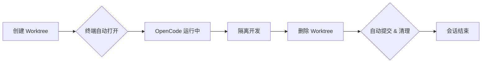

<p align="center">
  <h1 align="center">opencode-worktree</h1>
  <p align="center">
    Git Worktree 即开即用，自动生成独立终端，为 AI 驱动的开发提供零摩擦隔离环境。
  </p>
  <p align="center">
    <a href="https://www.npmjs.com/package/@devcxl/opencode-worktree" target="_blank">
      
    </a>
    <a href="https://www.npmjs.com/package/@devcxl/opencode-worktree" target="_blank">
      
    </a>
    <a href="./LICENSE" target="_blank">
      
    </a>
    <a href="https://github.com/devcxl/opencode-worktree/actions/workflows/ci.yml" target="_blank">
      
    </a>
    <a href="https://nodejs.org" target="_blank">
      
    </a>
    <a href="https://github.com/devcxl/opencode-worktree" target="_blank">
      
    </a>
  </p>
  <p align="center">
    <a href="./README_EN.md">English</a> | <b>简体中文</b>
  </p>
</p>

---

一个 [OpenCode](https://github.com/sst/opencode) 插件，用于创建隔离的 git worktree——每个 worktree 自动打开独立终端并在其中运行 OpenCode。无需手动设置，无需上下文切换，无需事后清理。

---

## 为什么需要这个插件

手动创建 worktree 需要：创建 worktree、打开终端、导航到目录、启动 OpenCode。OpenCode Desktop 虽然支持 worktree，但仅限于 GUI 流程。每一步都是摩擦。

本插件消除了所有摩擦。当 AI 调用 `worktree_create` 时，终端自动打开，OpenCode 自动运行，文件自动同步。当 AI 调用 `worktree_delete` 时，变更自动提交，worktree 自动清理。这不仅是拥有一个工具，而是拥有一个完整的工作流。

与 **[cmux](https://www.cmux.dev/)** 配合使用效果最佳，cmux 提供原生工作区管理和程序化控制能力，非常适合自动化开发工作流。同时支持 tmux。

## 何时使用

| 方式 | 适用场景 | 权衡 |
|----------|----------|-----------|
| **手动 git worktree** | 一次性实验，完全控制 | 手动设置，无自动清理，上下文切换 |
| **OpenCode Desktop UI** | 可视化工作流，集成体验 | 绑定桌面应用，自动化程度低 |
| **本插件** | AI 驱动工作流，自动化，CLI 优先用户 | 项目需要添加插件依赖 |

如果你偏向手动控制或只使用 OpenCode Desktop，本插件可能不是必需的。**但如果希望 AI 代理能无缝创建和管理隔离的开发会话——包括自动打开终端和自动状态清理——这就是你要找的工具。**

## 工作流程



1. **创建** - AI 调用 `worktree_create("feature/dark-mode")`
2. **终端打开** - 新窗口启动 OpenCode，工作目录为 `~/.local/share/opencode/worktree/<project-id>/feature/dark-mode`
3. **开发** - AI 在完全隔离的环境中实验
4. **删除** - AI 调用 `worktree_delete("reason")`
5. **清理** - 变更自动提交，git worktree 删除

Worktree 存储在 `~/.local/share/opencode/worktree/<project-id>/<branch>/`，位于仓库之外。

## 安装

在项目根目录的 `opencode.json` 中加入：

```json
{
  "$schema": "https://opencode.ai/config.json",
  "plugin": ["@devcxl/opencode-worktree"]
}
```

前置条件：**OpenCode 所使用的 shell 必须能直接执行 `node`**。

## 使用方法

插件提供两个工具：

| 工具 | 用途 |
|------|---------|
| `worktree_create(branch, baseBranch?)` | 创建新的 git worktree 用于隔离开发。自动打开新终端并运行 OpenCode。 |
| `worktree_delete(reason)` | 删除当前 worktree。删除前自动提交变更。 |

### 创建 Worktree

```yaml
worktree_create:
  branch: "feature/dark-mode"
  baseBranch: "main"  # 可选，默认为 HEAD
```

调用后：
1. 在 `~/.local/share/opencode/worktree/<project-id>/feature/dark-mode` 创建 git worktree
2. 根据 `.opencode/worktree.jsonc` 配置同步文件
3. 执行创建后钩子（如 `pnpm install`）
4. 打开新终端并运行 OpenCode

### 删除 Worktree

```yaml
worktree_delete:
  reason: "功能开发完成，合并到 main"
```

调用后：
1. 执行删除前钩子（如 `docker compose down`）
2. 提交所有变更并生成快照信息
3. 使用 `--force` 删除 git worktree
4. 清理会话状态

## 平台支持

插件自动检测终端环境：

| 平台 | 支持的终端 |
|----------|---------------------|
| **macOS** | Ghostty, iTerm2, Kitty, WezTerm, Alacritty, Warp, Terminal.app |
| **Linux** | Kitty, WezTerm, Alacritty, Ghostty, Foot, GNOME Terminal, Konsole, XFCE4 Terminal, xterm |
| **Windows** | Windows Terminal (wt.exe), cmd.exe 回退 |
| **cmux** | 检测到 `CMUX_WORKSPACE_ID` 或显式启用 socket 控制（`CMUX_SOCKET_PATH` + `CMUX_SOCKET_MODE=allowAll`）时使用原生 cmux 工作流；每个 worktree 启动创建新的 cmux workspace |
| **tmux** | 在所有平台上创建新的 tmux window |
| **WSL** | 通过 wt.exe 跨系统调用 Windows Terminal |

### 检测优先级

1. **tmux** - 所有平台运行时优先检测，已在 tmux 内时创建新 window，不切换终端应用
2. **cmux** - **推荐用于新的 AI 工作流**。通过 `CMUX_WORKSPACE_ID` 或显式 socket 控制检测，每个 worktree 启动创建新的 cmux workspace
3. **WSL** - Linux 子系统使用 Windows Terminal
4. **环境变量** - 检测 `TERM_PROGRAM`、`KITTY_WINDOW_ID`、`GHOSTTY_RESOURCES_DIR` 等
5. **回退** - 系统默认终端（Terminal.app、xterm、cmd.exe）

## 配置

首次使用时自动创建 `.opencode/worktree.jsonc`：

```jsonc
{
  "$schema": "https://github.com/devcxl/opencode-worktree/raw/main/schemas/worktree.json",

  "sync": {
    // 从主 worktree 复制的文件
    "copyFiles": [],
    // 软链接的目录
    "symlinkDirs": [],
    // 排除的模式
    "exclude": []
  },

  "hooks": {
    // 创建后执行
    "postCreate": [],
    // 删除前执行
    "preDelete": []
  }
}
```

### 常见配置

**Node.js 项目：**
```jsonc
{
  "sync": {
    "copyFiles": [".env", ".env.local"],
    "symlinkDirs": ["node_modules"]
  },
  "hooks": {
    "postCreate": ["pnpm install"]
  }
}
```

**Docker 项目：**
```jsonc
{
  "sync": {
    "copyFiles": [".env"]
  },
  "hooks": {
    "postCreate": ["docker compose up -d"],
    "preDelete": ["docker compose down"]
  }
}
```

## 常见问题

### 为什么不直接用 git worktree？

手动 worktree 需要手动设置：`git worktree add`、打开终端、导航、启动 OpenCode。每一步都是摩擦。本插件提供一个命令完成全部流程，包括文件同步和生命周期钩子。

### 是否兼容 OpenCode Desktop？

本插件创建的 worktree 可在 OpenCode Desktop 中正常使用，但无法自动打开终端。插件的核心价值在于 CLI 优先工作流和 AI 自动化——如果只使用 Desktop，可能不需要本插件。

### 忘记删除 worktree 会怎样？

变更保留在 `~/.local/share/opencode/worktree/<project-id>/<branch>`。分支存在于 git 中。你可以手动检出或删除它。插件不会强制清理——默认路径是方便，但非强制。

### 能否同时创建多个 worktree？

可以。每个 worktree 拥有独立的终端和 OpenCode 会话，完全隔离。

### 会不会影响现有的 git 工作流？

不会。它使用标准的 git worktree：`git worktree list` 可以看到它们，分支可以正常合并。

### 为什么不复用当前终端？

隔离。关闭 worktree 会话不会影响主工作流。如果 AI 出了什么问题，原始终端不受影响。

## 限制

### 安全

- 分支名会验证 git ref 规则和 shell 元字符
- 文件同步路径会验证防止目录遍历
- 钩子命令以用户权限在 worktree 目录中执行

### 终端启动

- macOS 上 Ghostty 使用内联命令避免权限弹窗
- Kitty 标签支持需要 `allow_remote_control` 配置（回退到窗口模式）
- 部分终端不支持标签页，会打开新的 OS 窗口

## 手动安装

## 声明

本项目并非由 OpenCode 团队构建，与 [OpenCode](https://github.com/sst/opencode) 无任何关联。

## 许可

MIT
